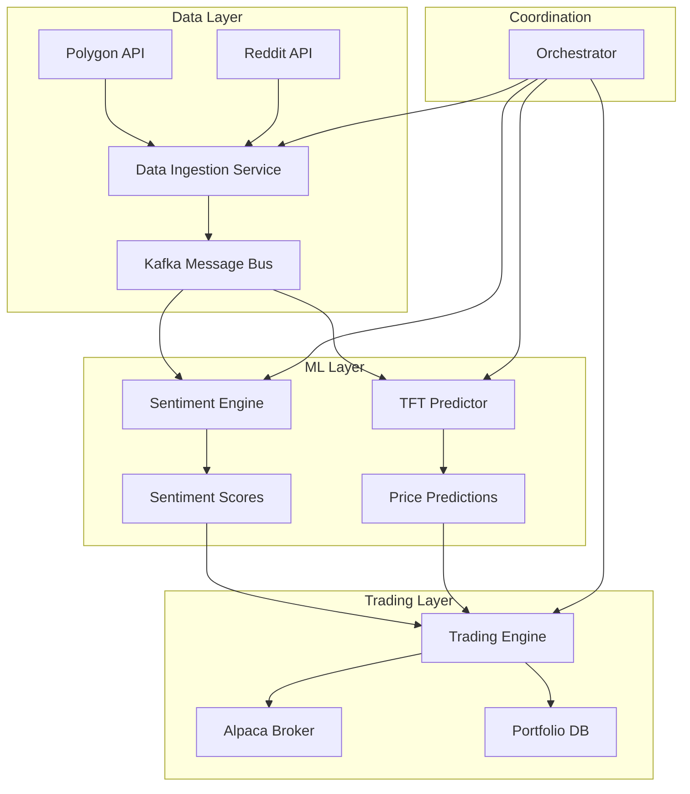

# 🚀 TFT Trading System - Microservices Architecture

A production-ready, institutional-grade trading system using Temporal Fusion Transformer (TFT) models with real-time sentiment analysis and automated portfolio optimization.

## 🏗️ Architecture Overview



## 🛠️ Microservices

| Service | Port | Description | Technology |
|---------|------|-------------|------------|
| **Orchestrator** | 8000 | Central coordination and API gateway | FastAPI, Kafka |
| **Data Ingestion** | 8001 | Market data and Reddit collection | FastAPI, AsyncIO |
| **Sentiment Engine** | 8002 | Real-time sentiment analysis | PyTorch, Transformers |
| **TFT Predictor** | 8003 | Stock price predictions | TensorFlow, GPU |
| **Trading Engine** | 8004 | Order execution and risk management | FastAPI, Alpaca |

## 🚀 Quick Start

### Prerequisites

- Docker & Docker Compose
- Python 3.11+
- 16GB+ RAM (8GB for GPU services)
- NVIDIA GPU (optional, for ML acceleration)

### 1. Clone and Setup

```bash
git clone <your-repo>
cd TFT

# Copy environment template
cp .env.example .env

# Edit .env with your API keys
nano .env
```

### 2. Start Infrastructure

```bash
# Start core infrastructure (Kafka, Redis, PostgreSQL)
docker-compose up -d kafka redis postgres

# Wait for services to initialize (30 seconds)
sleep 30
```

### 3. Start Microservices

```bash
# Start all microservices
docker-compose up -d

# Check service health
curl http://localhost:8000/health
curl http://localhost:8001/health
curl http://localhost:8002/health
```

## 🚦 Status & Features

### ✅ Implemented Microservices

- **Data Ingestion Service** (Port 8001)
  - Real-time market data from Polygon.io
  - Reddit sentiment data collection
  - Kafka message publishing
  - Rate limiting and caching

- **Sentiment Engine Service** (Port 8002)
  - GPU-accelerated transformer models
  - Real-time sentiment momentum calculation
  - Ticker extraction and analysis
  - Anomaly spike detection

### 🔄 Ready to Build

Use the advanced Copilot prompts from `advanced_copilot_prompts.py`:

```python
# Copy any prompt and let Copilot generate the service
create_microservice_tft_predictor()      # → services/tft-predictor/main.py
create_microservice_trading_engine()     # → services/trading-engine/main.py  
create_microservice_orchestrator()       # → services/orchestrator/main.py
```

## 🐳 Development Setup

### Start Individual Services

```bash
# Data Ingestion
cd microservices/data-ingestion
pip install -r requirements.txt
uvicorn main:app --reload --port 8001

# Sentiment Engine
cd microservices/sentiment-engine
pip install -r requirements.txt
uvicorn main:app --reload --port 8002
```

### Docker Compose (Recommended)

```bash
# Start all infrastructure + microservices
docker-compose up -d

# View logs
docker-compose logs -f sentiment-engine
docker-compose logs -f data-ingestion

# Scale services
docker-compose up -d --scale sentiment-engine=3
```

## 📈 Production Deployment

### Kubernetes

```bash
# Deploy to K8s cluster
kubectl apply -f k8s/microservices-deployment.yaml

# Check status
kubectl get pods
kubectl get services
kubectl get hpa  # Horizontal Pod Autoscalers
```

### Features Include:
- **Auto-scaling**: CPU/Memory-based HPA
- **GPU support**: NVIDIA device plugin integration
- **Health checks**: Liveness and readiness probes
- **Load balancing**: Service mesh ready
- **Resource limits**: Production resource allocations

## 💡 Next Steps

1. **Complete the remaining services** using Copilot prompts:
   ```bash
   # Generate TFT Predictor service
   # Copy: create_microservice_tft_predictor() → services/tft-predictor/main.py
   
   # Generate Trading Engine service  
   # Copy: create_microservice_trading_engine() → services/trading-engine/main.py
   
   # Generate Orchestrator service
   # Copy: create_microservice_orchestrator() → services/orchestrator/main.py
   ```

2. **Set up your API keys** in `.env` file:
   ```bash
   cp .env.example .env
   # Edit with your Polygon, Reddit, Alpaca keys
   ```

3. **Start the system**:
   ```bash
   docker-compose up -d
   ```

## 🔧 Architecture Benefits

✅ **Independent Scaling**: Each service scales based on load  
✅ **Technology Flexibility**: Python/FastAPI for APIs, PyTorch for ML  
✅ **Fault Isolation**: One service failure doesn't crash the system  
✅ **Development Speed**: Teams work independently on services  
✅ **Resource Optimization**: GPU nodes only for ML workloads  

## 📚 Key Files Created

```
TFT/
├── microservices/
│   ├── data-ingestion/         # ✅ Market & Reddit data collection
│   │   ├── main.py            # FastAPI service with Kafka publishing
│   │   ├── Dockerfile         # Production container
│   │   └── requirements.txt   # Python dependencies
│   │
│   ├── sentiment-engine/       # ✅ GPU-accelerated sentiment analysis  
│   │   ├── main.py            # Transformer models + momentum calculation
│   │   ├── Dockerfile         # GPU-enabled container
│   │   └── requirements.txt   # PyTorch + transformers
│   │
│   └── [tft-predictor, trading-engine, orchestrator]  # 🔄 Ready for Copilot
│
├── k8s/
│   └── microservices-deployment.yaml  # ✅ Production K8s manifests
│
├── docker-compose.yml         # ✅ Local development environment
├── .env.example              # ✅ Configuration template  
├── advanced_copilot_prompts.py # ✅ Enhanced with microservice prompts
└── README-microservices.md   # ✅ This comprehensive guide
```

**Ready to scale to institutional production! 🚀**
